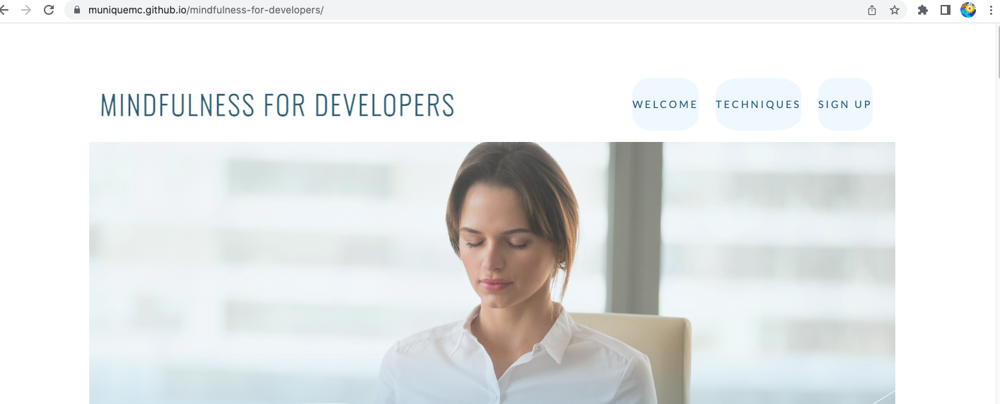
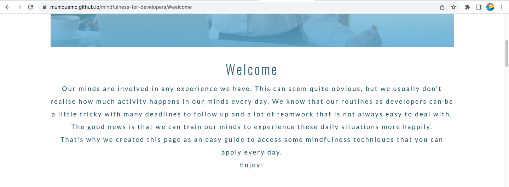

# Mindfulness for Developers

In completing my first module of the Code Institute's Diploma in Software Development Course, I applied what I learned in this project.
It was an amazing experience learning more about Mindfulness while practising HTML and CSS languages.

For link to this website click [Here](https://muniquemc.github.io/mindfulness-for-developers/)

This website was designed for *Desktop, Laptop and Tablets* but is also responsive on mobile devices.

## Who is this website for?

This website contains information about Mindfulness for anyone interested in the subject, especially those who work as developers.

## What does the website do?

The website brings valuable tips on developing a more mindful attitude for every situation.

It brings concepts and step-by-step instructions. It also links to youtube about meditation, breathing techniques and conservative principles.

It also offers the opportunity to join a community of developers who meet regularly and share their own experiences on how they apply mindful techniques in their lives.

## UX 5 Planes

### Strategy Plane

Mindful is a very extensive subject which involves different techniques. The strategy was to find a way where all the main information about the subject could be accessed quickly by the users.

### Scope Plane

The users have all the information they need to practice mindful techniques, all on a single page where they can easily scroll through sections, redirecting for complementary content when needed using the links provided along the page.

### Structure Plane

There are three links on the menu to provide access to the main sections of the single page.

- The first link in the menu brings the user to the Welcome section, where the purpose of the website is explained.

- The second link, 'Techniques,' directs the user to the section with the three main techniques that mindfulness is about.

-[Techniques](./assets/images/techniques.png)

### Skeleton Plane

Design was mainly focused on big screen (desktop, laptop) but you users can also access the page on a mobile device.

### Surface Plane

* Colors

The color palette was inspired by the pallet 'Ice Infinity' (#D9E4EC, #B7CFDC, #6AABD2,
#385E72) from the Canva app. The reason this pallet was chosen was to give the website a relaxing atmosphere.

* Typography

Two types of fonts were used, downloaded from the Google Fonts families:

**Lato** (weight: 300)

**Oswald** (weight: 200)

## Features

### Existing Features

* Created in HTML5 and CSS3
* Single page

## Technologies

- HTML5 for basic structure of the website
- CSS3 for style the website
- Google Fonts for fonts families
- Git for version control
- GitHub for storage the files and steps of development of the website

## Resources

- Code Institute course materials
- Code Institute Slack Community for support
- Code Institute Mentor meetings and support
- Am I Responsive for a responsive image in README 
- Wikipedia for references about the creator of Mindfulness
- Youtube for videos about mindfulness techniques

## Testing

### Browser testing

Website was tested in Google Chrome, Opera, Microsoft Edge and Safari. On each browser this website works properly (functionality, visuality).

It was tested on  Macbook Pro, Apple iPhone 12 and Samsung A6 and A10 mobile phones and the website worked on these type of devices.

### Validators

The website was checked by W3C HTML validator and it did not reported any issues. You can find the result [Here]()

## Version control

I used two repositories during the development: GitPod for local repository and GitHub for remote or background repository. 

I managed the versions with the followung process:
- I created a repository in GitHub
- I opened and developped the repository in GitPod
- I created and developped the files and folders in GitPod
- I saved and pushed my works to GitHub repository:
    1. git add . - adding work to git
    2. git commit -m "Commit message" - to commit the stage of work
    3. git push - to update my work in GitHub

## Publish the project

The steps of the publishing on the GitHub were as follow:
    
    1. **"Settings"** on the repository
    2. **"Source"** of "GitHub Pages" selected *master for Branch* and saved it
    3. The website was published on GitHub Pages and the link was provided in the same section.
